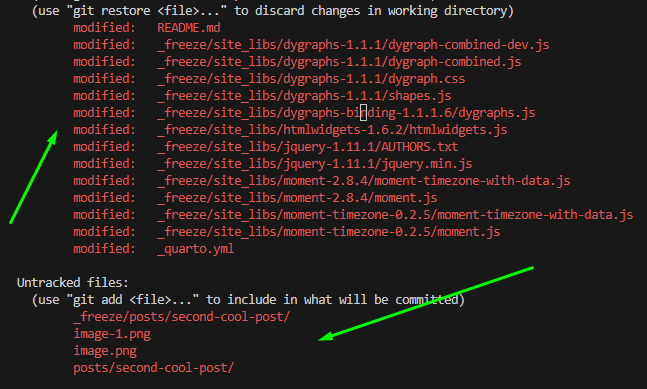

# Quarto Project hosted with Netlify

## Live site here: [https://oppkeyquarto.netlify.app/](https://oppkeyquarto.netlify.app/)

## Running locally

Clone repo

Use `quarto preview` to run locally. Ensure you are in the root directory of the Quarto project where the _quarto.yml file is located.

If you use `quarto serve` you may get the error:

ERROR: No input passed to serve.
If you are attempting to preview a website or book use the quarto preview command instead.

## Setup for Contributors

Install R using sudo apt-get install r-base and sudo apt-get install r-base-dev

Install R packages on Linux; type R in console and then install.packages('rmarkdown')

GGPLOT2 installation: install.packages("ggplot2")

dygraphs installation : install.packages("dygraphs")

## Project Setup

The .gitignore of this project is setup to ignore `_site/` and `.quarto/`

- `_site/` is also known as `docs/` in other quarto projects

- `_site` was specified as netlify publish directory on the website 

## Notable findings

- Only the freeze directory is needed when hosting on netlify using the [plugin](https://github.com/quarto-dev/netlify-plugin-quarto)

- Can use the "local only" ignoring files strategy. Each person adds `_freeze/` to the exclude file and only have one person who is reponsible for rendering and uploading to netlify

- When adding a new post these are the files that are added and the ones that are modified, I *manually* modified README.md and _quarto.yml

- Second time after initial setup these are the files that need to be added, my observation from this is that it's possible that only during initial setup  merge conflicts are a problem due to `site_libs/` directory. I think `site_libs/` is modified only when someone sets up quarto. I can try git_ignoring that directory and see if it causes a build failure or not on netlify. Maybe when someone is setting up R and the libraries on their computer it downloads and modifies this directory.

